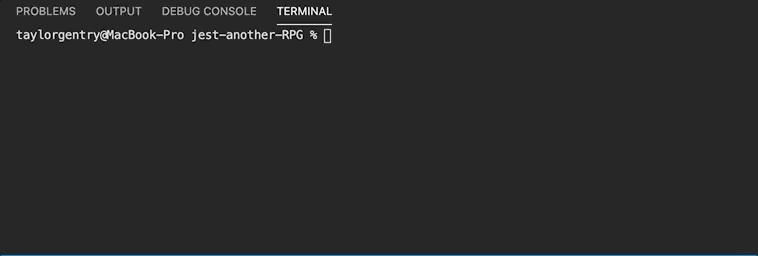

# Jest Another RPG


## 💬Description 

A Node.js based command-line role-playing game (RPG) in which a user battles against a series of enemies whose health and stats can be sustained by a potion. This project implements basic tests using the Jest framework, practicing test-driven developmennt (TDD), while also practicing object-oriented programming (OOP) by creating objects using constructor functions.


## 📓Table of Contents

* [Installation](#installation)
* [Usage](#usage)
* [Built With](#built)
* [License](#license)
* [Contributing](#contributing)
* [Tests](#tests)
* [Questions](#questions)


## 🔌Installation

The user should clone the repository from GitHub and open up the project in their code editor.


## 🎨Usage 
Please run command _node app.js_.
[Click me for walkthrough❗️](https://drive.google.com/file/d/1_MROsTzq2raz74C_XY3Nl1DGxqNmPP5m/view)
<br></br>


## ✏️Built With

<p><a href="https://nodejs.org/">Node.js</a></p>
<p><a href="https://www.npmjs.com/">NPM</a></p>
<p><a href="https://www.npmjs.com/package/inquirer">Inquirer.js</a></p>


## 🔐License
```
Copyright © MIT. All rights reserved. 
Licensed under the MIT license.
```


## 📌Contributing

Taylor Gentry ©2020 All Rights Reserved.


## 📊Tests

To test this project, please see the [Installation](#installation) section. Then run command _npm run test_.
<br></br>


## ❓Questions
If you have any questions about this projects, please contact me directly at tpgent01@outlook.com. 
You can view more of my projects at https://github.com/tpgent01 👾
